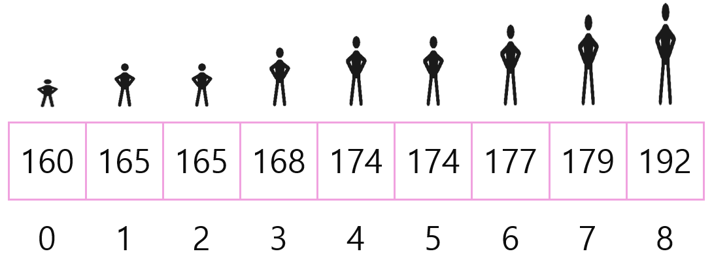
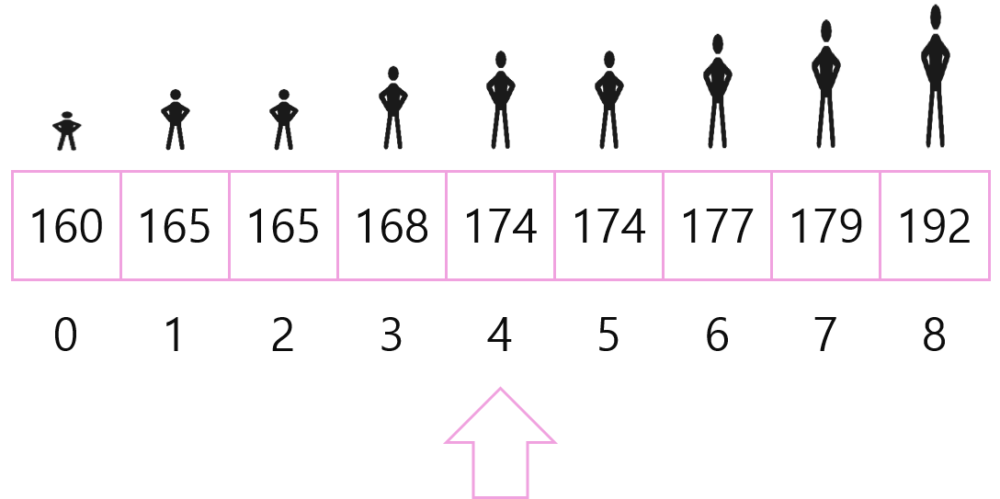
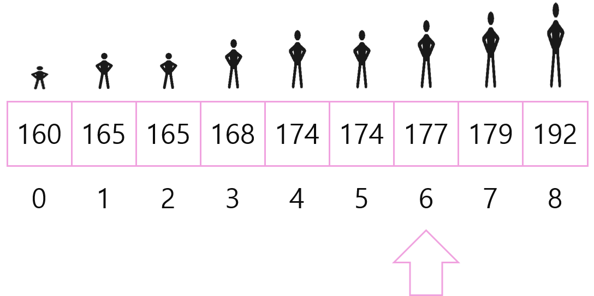
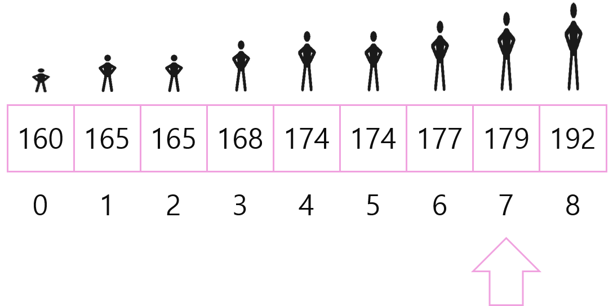

# 이진탐색(Binary Search)

다음의 배열이 있다.


배열의 데이터 중 9가 있는지 확인하기 위해서 다음과 같은 소스를 짜야 할 것이다.

```c++
// 찾는 값이 있는 index를 리턴한다
int find_index(int arr[], int len, int v) {
    for (int i = 0; i < len; i++)
        if (arr[i] == v)
            return i;
    
    return -1 // 찾는 값이 없을 경우
}
```

이 경우에 찾고자 하는 값이 수열의 뒷쪽에 있거나 값이 없을 때, 모든 배열의 값을 다 탐색한 후에야 index든 -1이든 리턴할 수 있을 것이다. 이를 시간복잡도로 나타내면 O(N)이다.


#### 더 빨리 찾아보자! 어떻게 할 수 있을까?

초등학교를 다닐 때 난 또래 남자아이들 중에서 키가 제일 작았다. 또 생일이 빠른은 아니지만, 생일이 느린 아이들 중에서는 가장 빨라서,  이게 어떤 의미를 갖는가? 내 **출석 번호는 항상 1번**이었다. 초등학교를 다닐 때 출석 번호는 으레 **키 순서 또는 생일 순과 같이 정렬**된 순서였을 것이다. 이를 적용해보자.

다음을 보자.


이처럼 정렬된 상태에서 키가 179인 현진이를 찾으려면 어떻게 할 수 있을까?

#### 가운데부터 찾아나가면서 찾는 범위를 좁혀나갈 수 있다.

이유는, 다음이 성립하기 때문이다.
$$
왼쪽 친구 <=나<=오른쪽친구
$$
배열의 시작 인덱스와 마지막 인덱스로부터 가운데 위치를 구할 수 있고, 위의 find_index() 함수를 아래와 같이 바꿔서 다시 적용해보자.

```c++
// 찾는 값이 있는 index를 이진탐색을 통해 리턴한다
int binary_find_index(int arr[], int len, int v) {
    int left = 0, right = len - 1;
    while (left <= right) {
        int mid = (right - left) / 2 + left; // index 범위의 오버플로우를 피하기 위함
        									// 또한 소수점 아래의 수는 버림한다.
        if (arr[mid] == v) return mid;
        if (arr[mid] > v) 
            right = mid - 1;
        else 
            left = mid + 1;
    }
    
    return -1 // 찾는 값이 없을 경우
}
```

위에서 보았던 배열과 함께 차근차근 적용해보자.


1. left : 0, right = 8, mid = (8 - 0) / 2 + 0 = 4
   
   174 < 179(현진이의 키)이므로 left = 5(mid + 1)을 수행한다.
   이유는, 키가 정렬이 되어 있기 때문에, 174보다 왼쪽에는 절대 179가 존재할 수 없기 때문이다.
2. left : 5, right = 8, mid = (8 - 5) / 2 + 5 = 6
   
   177 < 179이므로 left = 7을 수행한다.
3. left : 7, right : 8, mid = (8 - 7) / 2 + 7 = 7
   
   179 == 179이므로, index 7을 리턴한다.

위의 과정을 find_index() 함수를 통해 수행하였다면 총 7번 만에 답을 도출할 수 있었겠지만, binary_find_index() 함수를 통해서는 총 3번 만에 답을 도출하였다.
이를 시간복잡도로 표현하면 다음과 같다.

선형 탐색의 시간 복잡도(find_index()) : O(N)
이진 탐색의 시간 복잡도(binary_find_index()) : O(logN)


### 이진 탐색을 적용 가능한 예


이진탐색을 이해하기 위해 수학적으로 나타내면 아래와 같은 그래프로 나타낼 수 있다.

